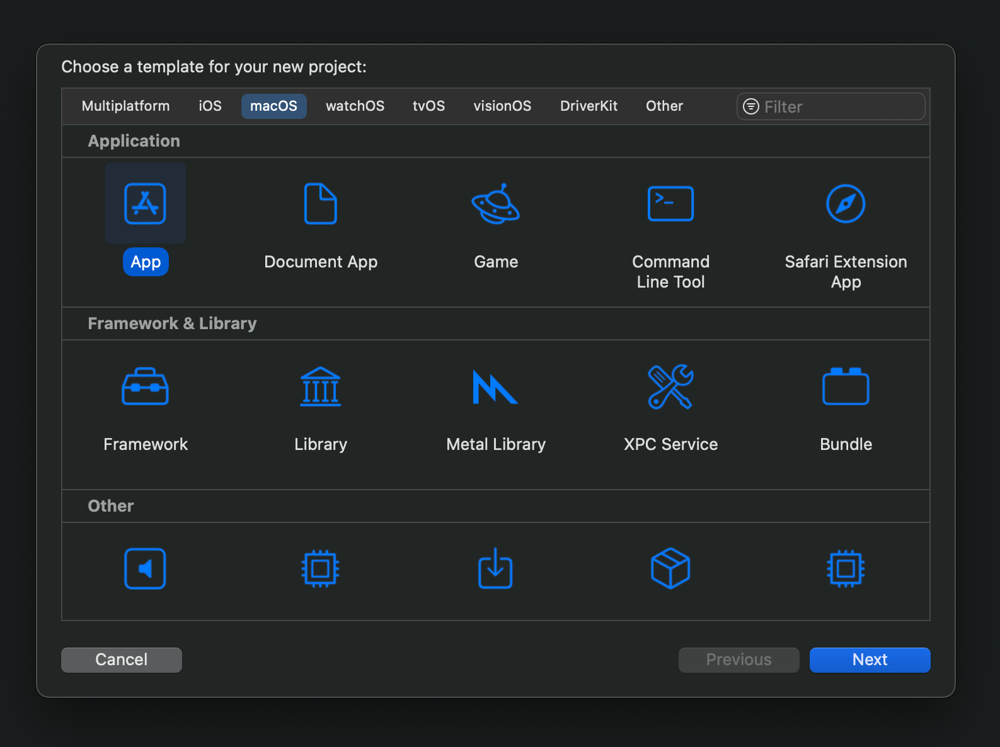

# Getting Started on Swift

This guide will walk you through the steps to integrate RecordKit into your Swift app. By the end you will be able to make a screen recording.

::: details Starting from scratch?
1. Start [Xcode](https://developer.apple.com/xcode/) choose "Create New Project..." from the launch screen.
2. Choose macOS, select App and click Next. 
3. Make sure to choose SwiftUI as interface setting and Swift for the language.



When finished a new Xcode project will open, you can now continue this Getting Started guide.
:::

## 1. Adding RecordKit

RecordKit for Swift is installed as a SPM (Swift Package Manager) package.

1. Choose File, Add Package Dependencies...
2. Enter the RecordKit package URL in the search field top right: `https://github.com/nonstrict-hq/RecordKit`
3. Select RecordKit from the list and choose Add Package.

Make sure the RecordKit library is added to your macOS app target.

## 2. Start a recording

1. Discover the devices, windows or displays to record.

```Swift
let windows = try await RKRecorder.getWindows()
let cameras = RKRecorder.getCameras()
let microphones = RKRecorder.getMicrophones()
let appleDevices = await RKRecorder.getAppleDevices() // iPhones, iPads, etc.
```

2. Configure & start a recorder

```Swift
// Configure the recorder
let recorder = RKRecorder([
        .windowBasedCrop(windowID: windows.first!.id),
        .webcam(microphoneID: microphones.first!.id, cameraID: cameras.first!.id),
        .appleDevice(deviceID: appleDevices.first!.id)
    ])

// Calling prepare is highly recommended, this activates all devices and makes sure a call to start will start the recording instantly.
// (Screen recording & camera indicators will be visible to the user after calling prepare, also permission alerts might be triggered.)
try await recorder.prepare()

// Actually start recording
recorder.start()
```

3. Finish the recording

```Swift
// Stop the recording, returns information about the recording
let result = try await recorder.stop()
```

For handling errors and setting up logging, see [Logging and Error Handling](/guides/logging-and-errors).
